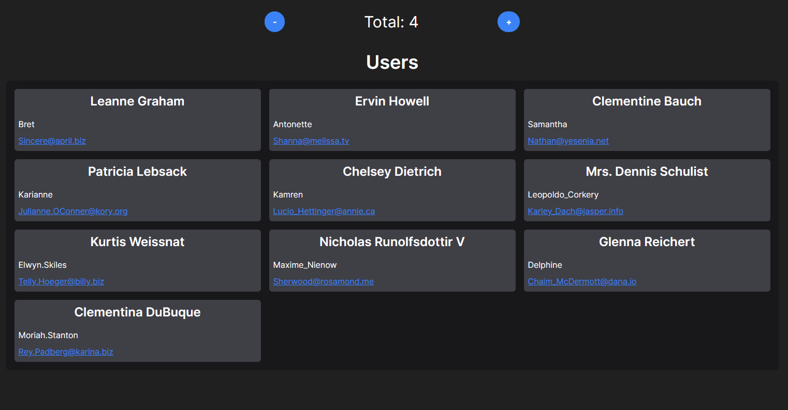

Este es un [Next.js](https://nextjs.org/) proyecto con [`create-next-app`](https://github.com/vercel/next.js/tree/canary/packages/create-next-app).

# Next.js + TailwindCSS + Redux Toolkit

Este es un proyecto creado con Next.js, TailwindCSS y Redux Toolkit.

## Screenshots


## Instalación

1. Clona el repositorio.
2. Ejecuta `npm install` para instalar las dependencias.
3. Ejecuta `npm run dev` para iniciar el servidor de desarrollo.
```bash
npm run dev
# or
yarn dev
# or
pnpm dev
```

## Características

- Next.js para el marco de trabajo de React.
- TailwindCSS para el diseño y estilos.
- Redux Toolkit para la gestión del estado.
- React Redux para conectar componentes de React con el estado de Redux.

Abre [http://localhost:3000](http://localhost:3000) con tu navegador para ver el resultado.

Puedes empezar a editar la página modificando `app/page.tsx`. La página se actualiza automáticamente mientras editas el archivo.

Este proyecto utiliza [`next/font`](https://nextjs.org/docs/basic-features/font-optimization) para optimizar y cargar automáticamente Inter, una fuente personalizada de Google.

## Aprende más

Para aprender más sobre Next.js, echa un vistazo a los siguientes recursos:

- [Documentación de Next.js](https://nextjs.org/docs) - aprende sobre las características y API de Next.js.
- [Aprende Next.js](https://nextjs.org/learn) - un tutorial interactivo de Next.js.

Puedes visitar [el repositorio de Next.js en GitHub](https://github.com/vercel/next.js/) - ¡tu feedback y contribuciones son bienvenidos!

## Despliegue en Vercel

La forma más fácil de desplegar tu aplicación Next.js es utilizar la [Plataforma Vercel](https://vercel.com/new?utm_medium=default-template&filter=next.js&utm_source=create-next-app&utm_campaign=create-next-app-readme) de los creadores de Next.js.

Consulta nuestra [documentación de despliegue de Next.js](https://nextjs.org/docs/deployment) para obtener más detalles.